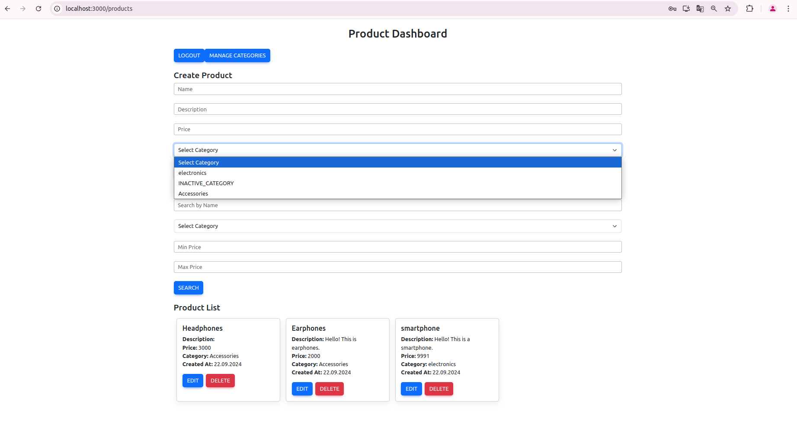

# 

## Описание

Это веб-приложение разработано с использованием `Spring Boot` и `React`. Оно позволяет клиентам регистрироваться, авторизовываться и просматривать продукты, а администраторы могут управлять как продуктами, так и категориями. Для аутентификации используется `ROLE_USER` и `ROLE_ADMIN`, что предоставляет различные уровни доступа к функциональности приложения.
Авторизация и аутентификация происходит при помощи JWT токенов.

## Основные функции

- Пользователи (с ролью `ROLE_USER`) могут просматривать продукты.
- Администраторы (с ролью `ROLE_ADMIN`) могут управлять продуктами и категориями.
- Администраторы имеют доступ к странице редактирования категорий.

## Технические требования

### Backend
- Java 17
- Spring Boot
- Maven
- PostgreSQL

### Frontend
- Node.js 18.x
- React

## Инструкция по развёртыванию

### 1. Подготовка окружения

#### Установите необходимые инструменты:

1. **Java 17**: Убедитесь, что Java 17 установлена на вашей машине.

2. **Maven**: Убедитесь, что Apache Maven установлен.

3. **PostgreSQL**: Установите `PostgreSQL` для хранения данных пользователей.

4. **Node.js и npm**: Установите `Node.js` версии 18 и выше.

### 2. Клонирование репозитория


1. Перед началом установки клонируйте репозиторий с исходным кодом приложения:

    ``` bash
    git clone https://github.com/krr006/OnlineStore.git
    cd OnlineStore

### 3. Настройка базы данных

#### PostgreSQL:

1. Запустите `PostgreSQL`, таблицы и указанная в `application.yml` база данных создадутся автоматически при запуске приложения.

2. Создайте специальную категорию для неактивных продуктов:
    ```sql
    INSERT INTO category (id, name, description)
    VALUES (0, 'INACTIVE_CATEGORY', 'This category is inactive');

3. Обновите настройки подключения в `application.yaml`:
    ```yaml
    spring:
      datasource:
        url: jdbc:postgresql://localhost:5432/postgres
        username: postgres
        password: password
        driver-class-name: org.postgresql.Driver

### 4. Запуск бэкенда (Spring Boot)

1. Перейдите в директорию `online-store`:
    ```bash
   cd online-store

2. Соберите проект с помощью Maven:
    ```bash
    mvn clean package

3. Запустите Spring Boot приложение:
    ```bash
    mvn spring-boot:run

### 5. Запуск фронтенда (React)

1. Перейдите в директорию `frontend-app`:
   ```bash
   cd frontend-app

2. Установите зависимости:
    ```bash
    npm install

3. Запустите фронтенд-приложение:
    ```bash
    npm start

Фронтенд будет доступен по адресу `http://localhost:3000`.

## Обзор функциональности

1. При переходе по адресу `http://localhost:3000` будет предложено войти в систему или, если еще нет аккаунта, создать его.
Создайте пользователя с `username` `admin`, система автоматически присвоит ему роль администратора:


2. Перейдите на страницу с категориями, нажав кнопку `MANAGE CATEGORIES` и создайте несколько категорий:


3. Перейдите на страницу с продуктами, нажав кнопку `GO TO PRODUCTS` и создайте несколько продуктов, категория выбирается в выпадающем списке.


4. Выполните поиск, применив различные фильтры:


5. Можете также выбрать категорию при поиске:

